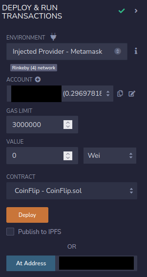
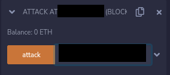

# 03: Coin Flip

The Ethernaut is a Web3/Solidity based wargame inspired by overthewire.org, played in the Ethereum Virtual Machine, in which each level is based on a smart contract that needs to be "hacked".

This is a sample walkthrough for the level called "CoinFlip".

## Setup

First off we need a wallet. Get the Metamask Wallet from https://metamask.io/ and choose whichever network works for you ( in my case i will be using Rinkeby's testnet).
Fund the wallet with Chainlink's faucet https://faucets.chain.link/rinkeby and then click on the button "Get new instance" to deploy the contract.

## Steps for completing the level
Click on F12 to get on Developer Tools. You will get something like this:

Go on Remix: https://remix.ethereum.org/ and make these changes in both CoinFlip.sol and SafeMath.sol. 

Copy the CoinFlip.sol contract found before "submit instance" and "get new instance" buttons and get SafeMath.sol one from https://github.com/OpenZeppelin/openzeppelin-contracts/blob/master/contracts/utils/math/SafeMath.sol.

At CoinFlip.sol i made these next changes:
>- <value> 1. Pragma version from **0.6.0** to **0.8.17** 
>- <value> 2. Change **"@openzeppelin/contracts/math/SafeMath.sol"** with **"./SafeMath.sol"**

And at SafeMath.sol:
>- <value> 1. Pragma version from **0.8.0** to **0.8.17**

Tried to find some information about the blockhash function and found everything i needed in this video: https://youtube.com/watch?v=8FF3IBTMeK0/. This level asks us to guess the right side of the flip function, basically by knowing what's the value of the blockhash. Because we are unnable to guess the right side 10 times, we are going to build another contract, who's gonna attack the CoinFlip contract and will be able to guess the side as many times as we want. The other contract that we build will be similar to the famous "Reetrancy Attack" 

More about Reentrancy Attack and how it works here: https://solidity-by-example.org/hacks/re-entrancy/.

Now make a new contract called Attack, below the CoinFlip.sol one and add the global variables, fallback function and the attack function:
>- <value> using SafeMath for uint256;
>- <value> uint256 lastHash;
>- <value> uint256 FACTOR = 57896044618658097711785492504343953926634992332820282019728792003956564819968;
>- <value> fallback() external payable {} 
>- <value> function attack(CoinFlip coinFlipIt) public {
>- <value> uint256 blockValue = uint256(blockhash(block.number.sub(1)));
>- <value> uint256 coinFlip = blockValue.div(FACTOR);
>- <value> bool side = coinFlip == 1 ? true : false;
>- <value> coinFlipIt.flip(side);}

It should look something like this:

Compile both contracts:

Now instead of deploying CoinFlip.sol we are going to interact with the already deployed contract by using instance address showed on Developer Tools and we will be deploying ourselves the Attack.sol contract to the Rinkeby's Testnet. Also, dont forget to add your wallet on Environment by selecting "Injected Provider - Metamask".

After deploying CoinFlip.sol we can see that we have 0 guessed sides:

Go and paste the instance's address of the CoinFlip level that you have into the attack section and hit "attack" button:

After that, try and check your consecutiveWins function:

Wow, congrats!! You managed to guess one side already. Try and use the same attack function 9 more times and you will beat this level. 

Now finish the level by using the submit button at the bottom of the page.

Congrats! See you on to the next level.:wave: