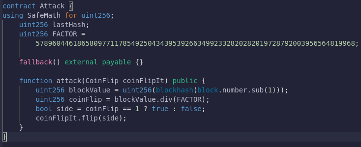

# 02: Fallout

The Ethernaut is a Web3/Solidity based wargame inspired by overthewire.org, played in the Ethereum Virtual Machine, in which each level is based on a smart contract that needs to be "hacked".

This is a sample walkthrough for the level called "Fallout".

## Setup

First off we need a wallet. Get the Metamask Wallet from https://metamask.io/ and choose whichever network works for you ( in my case i will be using Rinkeby's testnet).
Fund the wallet with Chainlink's faucet https://faucets.chain.link/rinkeby and then click on the button "Get new instance" to deploy the contract.

## Steps for completing the level
Click on F12 to get on Developer Tools. You will get something like this:

Go on Remix: https://remix.ethereum.org/ and make these changes in both Fallout.sol and SafeMath.sol. 

Copy the Fallout.sol contract found before "submit instance" and "get new instance" buttons and get SafeMath.sol one from https://github.com/OpenZeppelin/openzeppelin-contracts/blob/master/contracts/utils/math/SafeMath.sol.

At Fallout.sol i made these next changes:
>- <value> 1. Pragma version from **0.6.0** to **0.8.17** 
>- <value> 2. Change **"@openzeppelin/contracts/math/SafeMath.sol"** with **"./SafeMath.sol"**
>- <value> 3. There is 1 **"owner = msg.sender"**. Add another **"="**, and it should have **"owner == msg.sender"**
>- <value> 4. At line 32 change from "msg.sender" to "payable(msg.sender)" due to the changes made in Solidity 0.8.x versions, in which addresses are not payable by default

Refer for more here: https://stackoverflow.com/questions/68121086/typeerror-send-and-transfer-are-only-available-for-objects-of-type-address

And at SafeMath.sol:
>- <value> 1. Pragma version from **0.8.0** to **0.8.17**

Compile both contracts:

Now instead of deploying Fallout.sol we are going to interact with the already deployed contract by using instance address showed on Developer Tools. Dont forget to add your wallet on Environment by selecting "Injected Provider - Metamask".

If we check owner function we can see the owner its the level's address:

The single option to become the owner of the contract that we have is accessing the "fal1out" function. Simply click on "Fal1out" button, confirm the transaction and now you are the owner of the contract.

Check the owner call function and you can see your wallet's address. Easy, right? Congrats, you managed to hack into this smart contract.

Now finish the level by using the submit button at the bottom of the page.

Congrats! See you on to the next level.:wave: